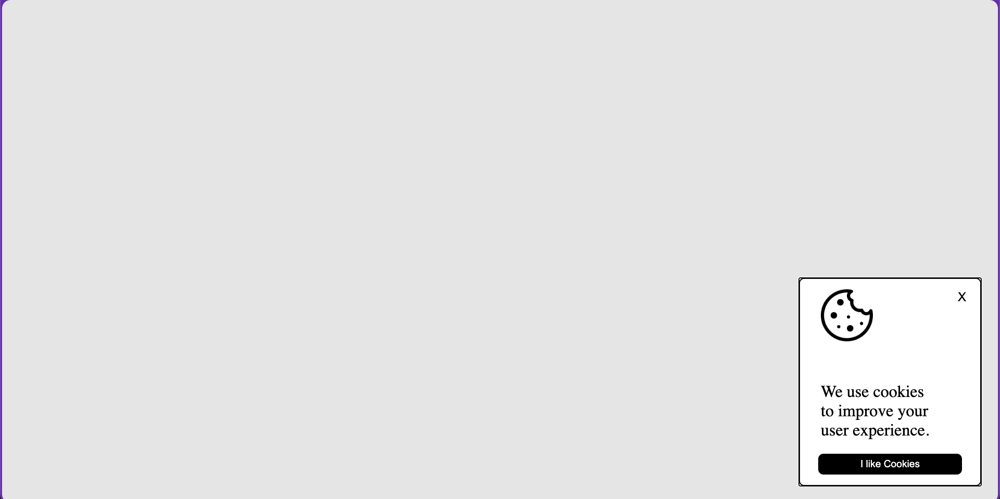

# Cookie Consent Banner

A simple cookie consent popup built with vanilla HTML, CSS, and JavaScript. It appears when a visitor lands on the page, and once they accept, it stays dismissed on future visits.

This project is a hands-on introduction to **DOM manipulation**, **event handling**, and **browser storage**.

Project idea from [roadmap.sh](https://roadmap.sh/projects/cookie-consent).

## Preview

;

## Features

- Popup appears automatically on the first visit
- Built on the native HTML `<dialog>` element
- Two ways to dismiss: the **X** button or the **"I like Cookies"** button
- Consent is saved in `localStorage`, so the popup won't reappear on later visits
- No frameworks or dependencies

## Project Structure

```
.
├── index.html
├── style.css
├── script.js
└── images/
    ├── cookies.png
    └── preview.png
```

## Getting Started

1. Clone or download this repository.
2. Make sure a cookie icon exists at `images/cookies.png` (any image works, just keep the file name or update the `src` in `index.html`).
3. Open `index.html` in your browser. You can also use a local server such as the VS Code **Live Server** extension.

The popup will appear in the bottom-right corner of the screen.

## How It Works

**`index.html`**
The popup is a `<dialog>` element containing a cookie icon, a close (X) button, a short message, and an accept button. Both buttons share the class `close-modal-btn`.

**`style.css`**
Positions the dialog in the bottom-right corner using `position: fixed`, and styles the container, buttons, and hover states.

**`script.js`**
1. Selects the `<dialog>` element.
2. Checks `localStorage` for a `cookies` key. If it isn't `"true"`, the dialog is opened with `showModal()` (after the DOM has loaded, if needed).
3. Attaches a click listener to every `.close-modal-btn`. Clicking one closes the dialog and saves `cookies = "true"` to `localStorage`.

## Resetting Consent

To see the popup again while testing, clear the stored value by running this in the browser console:

```js
localStorage.removeItem("cookies");
```

Then refresh the page. You can also clear it from DevTools under **Application → Local Storage**.

## Customization Ideas

- Change the message text in `index.html`
- Swap the icon or colors to match your brand
- Add a "Decline" button that stores a different value
- Use a real cookie (`document.cookie`) with an expiry date instead of `localStorage`
- Add a fade-in or slide-in animation when the popup appears

## Notes

- `showModal()` displays the dialog as a modal, which dims the page behind it and blocks interaction until it is closed.
- `localStorage` is per-browser and per-origin, so consent is remembered only on the same browser and domain.
- Opening the file directly (`file://`) works in most browsers, but storage behavior can vary. A local server is more reliable.

## Concepts Practiced

- Selecting elements with `querySelector` and `querySelectorAll`
- Adding event listeners
- Using the `<dialog>` API (`showModal()` and `close()`)
- Reading and writing `localStorage`
- Handling `DOMContentLoaded` and `document.readyState`

## Author

Kunal Guhagarkar